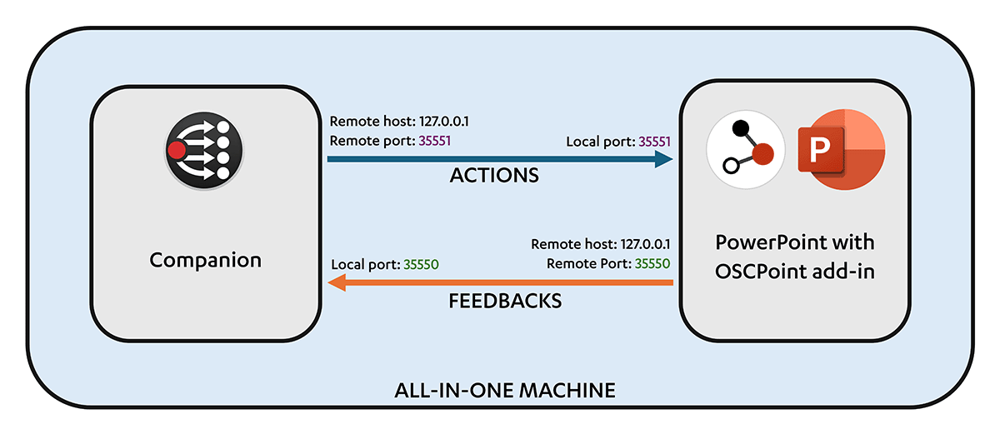
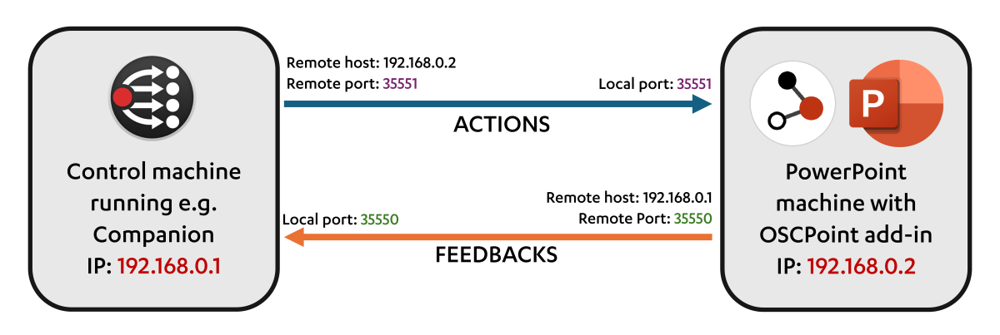
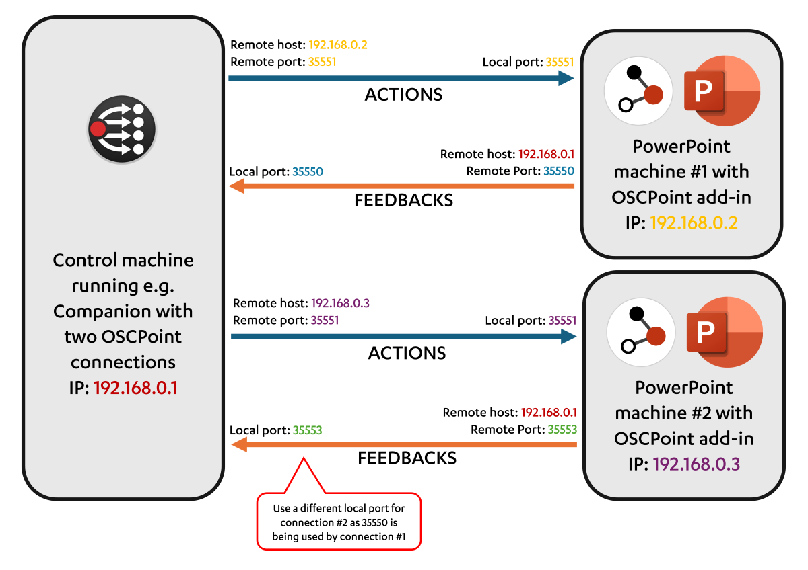

# Connection examples

> Note: These examples are based on the assumption that you are running Companion to control OSCPoint - but lots of tools that can receive/output OSC can be used.

## One machine running both Companion and PowerPoint

In this configuration, the both the Companion service and OSCPoint are running on the same machine, and they talk to each other via the localhost network address of `127.0.0.1`

## One Companion machine, one PowerPoint machine

In this configuration, the Companion service is running on one machine, and OSCPoint is running on another. The two machines are connected via a network.

## One Companion machine, two PowerPoint machines

In this configuration, the Companion service is running on one machine, and OSCPoint is running on two machines. The machines are connected via a network.

Companion has two OSCPoint connections running. To get feedback from both machines, the feedback port needs to be changed on the second machine.

