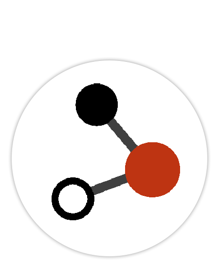

<h2>OSCPoint: an OSC API for PowerPoint</h2>

**OSCPoint is a free PowerPoint add-in - and Companion Module - that allows Open Sound Control (OSC) control of PowerPoint on Windows.**

While the add-in is designed to be used with BitFocus Companion, it should work with any OSC client that can send and receive OSC messages over UDP.

## The add-in

_Screenshot shows the OSCPoint tab on the PowerPoint ribbon_

The OSCPoint add-in is intalled on your Windows machine, and runs alongside PowerPoint. It provides an OSC API for PowerPoint.

To find out more about the add-in and download the latest verion, check the [add-in documentation](add-in.md).

## The Companion module

_A sample Streamdeck layout using the Companion OSCPoint module_

The Companion OSCPoint module (listed as **Zinc: OSCPoint**) simplifies the process of triggering OSCPoint actions and displaying OSCPoint feedbacks.

To find out more about the module, check the [Companion module documentation](companion-module.md).

## Capabilites and limitations

> [!WARNING]
> OSCPoint is still under active development, and has not reached a beta-stage yet. There are likely to be bugs, and the API may change without warning.
> 
> **DO NOT USE ON PRODUCTION SYSTEMS (YET)**
>
> If you give this a go, please share your feedback and issues using the [issue tracker on GitHub](https://github.com/phuvf/oscpoint/issues).

OSCPoint allows you to control PowerPoint using **actions**, and get information about the state of PowerPoint using **feedbacks**.

See the [Actions](actions.md) and [Feedbacks](feedbacks.md) files for full details.

### Highlights

- Start & stop slideshows, and navigate slides
- Control media playback including jumping to specific times in clip
- Get feedback on the current slide and current build
- Get full live notes text via OSC feedback
- Get feedback on media state, playback position and runtime

OSCPoint is Windows-only, and requires PowerPoint 2016 or later.

> OSCPoint gives you the ability to navigate your PowerPoint show without it being the active (focussed) window.
>
>Media elements, slide transitions and OSC feedbacks may not play correctly when PowerPoint does not have focus.
>
>To summarise, don't run PowerPoint in the background and expect OSCPoint to work correctly.

## Roadmap

See the [enhancements](https://github.com/phuvf/oscpoint/issues?q=is%3Aopen+is%3Aissue+label%3Aenhancement) label in issues for details of suggested features.

## Support

OSCPoint is developed by [Nick Roberts](https://github.com/phuvf). My day job is head of development for [OctoCue](https://octocue.com), so the OSCPoint PowerPoint add-in uses OctoCue's code signing certificate, in exchange for a bit of brand exposure.

If you have questions or find bugs please use the [issue tracker on GitHub](https://github.com/phuvf/oscpoint/issues).

For feature requests, please check the [enhancements](https://github.com/phuvf/oscpoint/issues?q=is%3Aopen+is%3Aissue+label%3Aenhancement) label in issues, and if your idea isn't there, please [raise a new issue](https://github.com/phuvf/oscpoint/issues/new?labels=enhancement&template=feature_request.md) on GitHub.

If you find this project useful, consider buying me a coffee:

I'm always looking for interesting ideas to work on - check out my [GitHub profile](https://github.com/phuvf) to see if I might be a good match for your project.

## Credits

This project was inspired by the following:

- https://www.irisdown.co.uk/rsc.html - the OG PowerPoint API
- https://github.com/benkuper/PowerPoint-OSC
- https://github.com/leonreucher/powerpoint-remote-websocket

I'd also like to thank the members of the [Companion User Group](https://www.facebook.com/groups/companion) on Facebook for their ideas and suggestions.

## Privacy

See the [privacy policy](privacy.md) for details of how OSCPoint collects and handles your data.

## License

This project is licensed under the MIT License - see the [LICENSE](LICENSE) file for details.
