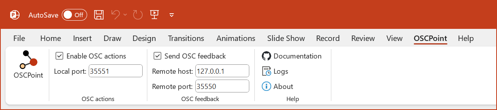

<h2>OSCPoint: an OSC API for PowerPoint</h2>

**OSCPoint is a free PowerPoint add-in that allows Open Sound Control (OSC) control of PowerPoint on Windows.**

It's primarily designed to be used with BitFocus Companion, but should work with any OSC client that can send and receive OSC messages over UDP.

_The **OSCPoint** tab on the PowerPoint ribbon_

> [!WARNING]
> OSCPoint is still under active development, and has not reached a beta-stage yet. There are likely to be bugs, and the API may change without warning.
> 
> **DO NOT USE ON PRODUCTION SYSTEMS (YET)**
>
> If you give this a go, please share your feedback and issues using the [issue tracker on GitHub](https://github.com/phuvf/oscpoint/issues).
>
> A Bitfocus Companion module to accompany OSCPoint is current in development, but is not yet included in the current Companion builds - see [companion-module-zinc-oscpoint](https://github.com/bitfocus/companion-module-zinc-oscpoint) for details.

## Support

OSCPoint is developed by [Nick Roberts](https://github.com/phuvf). My day job is head of development for [OctoCue](https://octocue.com), so the OSCPoint PowerPoint add-in uses OctoCue's code signing certificate, in exchange for a bit of brand exposure.

If you have questions or find bugs please use the [issue tracker on GitHub](https://github.com/phuvf/oscpoint/issues).

For feature requests, please check the [Roadmap](#roadmap) section below, and if your idea isn't there, please [raise an issue](https://github.com/phuvf/oscpoint/issues/new?labels=enhancement&template=feature_request.md) on GitHub.

If you find this project useful, consider buying me a coffee:

I'm always looking for interesting ideas to work on - check out my [GitHub profile](https://github.com/phuvf) to see if I might be a good match for your project.

## Capabilites and limitations

OSCPoint allows you to control PowerPoint using **actions**, and get information about the state of PowerPoint using **feedbacks**.

See the [Actions](ACTIONS.md) and [Feedbacks](FEEDBACKS.md) files for full details.

OSCPoint is not:

- Available on plaforms other than Windows
- A one-stop GUI for controlling PowerPoint - we recommend using in conjunction with Bitfocus Companion for this:

> [!WARNING]
> OSCPoint gives you the ability to navigate your PowerPoint show without it being the active (focussed) window.
> 
> Media elements, slide transitions and OSC feedbacks may not play correctly when PowerPoint does not have focus.
>
> To summarise, don't run PowerPoint in the background and expect OSCPoint to work correctly.

## Installation instructions
- Download the [latest version](https://github.com/phuvf/oscpoint/releases)
- Unpack the .zip file to a temporary folder
- Run setup.exe from the temporary folder
- Once installation is complete, you can delete your temporary folder.

This COM add-in for PowerPoint requires some supporting frameworks, including:

- Microsoft .NET 4.7.2 (66MB)
- Microsoft Visual Studio 2010 Tools for Office Runtime (38MB)

Your computer will automatically download and install these items direct from Microsoft, if required.

Finally, if PowerPoint is currently running on your machine, you'll need to close and re-open it to load up the add-in.

For more details, including infomation on SmartScreen warnings, see the [installation guide for the OctoCue add-in](https://support.octocue.com/docs/add-in/add-in_installation), which follows exactly the same process - this avoids me writing it out twice.

## Configuration
The add-in will add a new **OSCPoint** tab to the PowerPoint ribbon.

Using the ribbon tab you can:

- Enable and disable OSC actions and feedbacks.
- Set the local port for incoming action messages - range is `1024` to `65535`, default `35551`
- Set the remote host for outgoing feedback messages - default `127.0.0.1`
- Set the remote port for outgoing feedback messages - range is `1024` to `65535`, default `35550`

Configuration settings are stored on your machine per-user and will persist between sessions.

## OSC Actions

OSC actions are messages you can send to OSCPoint to control PowerPoint.

See [ACTIONS.md](ACTIONS.md) for a full list of OSC actions available.

## OSC Feedbacks

Feedbacks are the messages OSCPoint sends to your OSC client to tell you about the current state of PowerPoint.

See [FEEDBACKS.md](FEEDBACKS.md) for a full list of OSC feedbacks available.

## Roadmap

These ideas have been suggested, but are not yet implemented:

- Feedback for when a slide transition is running
- Screen switching in/out of presenter view
- Presenter view slide notes text size and scrolling (not sure this is possible)
- Save slide as wallpaper
- Load presentation using filename/path
- Select and play a named slide show

For more details, please see the [enhancements](https://github.com/phuvf/oscpoint/issues?q=is%3Aopen+is%3Aissue+label%3Aenhancement) label in issues.

## Credits

This project was inspired by the following:

- https://www.irisdown.co.uk/rsc.html - the OG PowerPoint API
- https://github.com/benkuper/PowerPoint-OSC
- https://github.com/leonreucher/powerpoint-remote-websocket

I'd also like to thank the members of the [Companion User Group](https://www.facebook.com/groups/companion) on Facebook for their ideas and suggestions.

## License

This project is licensed under the MIT License - see the [LICENSE](LICENSE) file for details.
