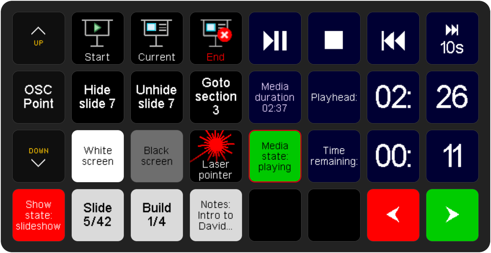

# The OSCPoint Companion module

_A sample Streamdeck layout using the Companion OSCPoint module_

The Companion OSCPoint module (listed as **Zinc: OSCPoint**) simplifies the process of triggering OSCPoint actions and displaying OSCPoint feedbacks by using the popular [Bitfocus Companion software](https://bitfocus.io/companion).

This module is currently available in beta builds of Companion v3.2.x. If you'd like to run this module in the current stable v3.1.x, please follow [these instructions](https://github.com/bitfocus/companion-module-base/wiki#4-clone-the-module).

### Further actions

- [Download Companion](https://bitfocus.io/companion)
- [Link to module repository](https://github.com/bitfocus/companion-module-zinc-oscpoint)