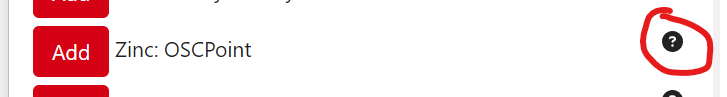

# The OSCPoint Companion module

_A sample Streamdeck layout using the Companion OSCPoint module_

The Companion OSCPoint module (listed as **Zinc: OSCPoint**) simplifies the process of triggering OSCPoint actions and displaying OSCPoint feedbacks by using the popular [Bitfocus Companion software](https://bitfocus.io/companion).

This module is available in builds of Companion v3.2.0+

## Updating the Companion module

New versions of the OSCPoint Companion module are automatically included in new releases of Companion.

However, these only come out a few times a year, so you may wish to manually update your Companion installation to get the latest OSCPoint goodness without having to wait for the Companion update cycle.

To do this, follow these steps:

### 1 - Setup the module folder

- Create a folder on your machine to store the module files.  
This can be anywhere, but for this example we'll use `companion-modules` in my `git` directory.

### 2 - Download and unzip the latest module package

- Download the latest module version from [https://oscpoint.com/companion](https://oscpoint.com/companion). This will be a `.zip` file.
- Extract the contents of the `.zip` file into the folder you created in step 1.  
This will create a structure `companion-modules/oscpoint-module-x.x.x-pkg/`.
- Inside this folder, you should have a `main.js`, a `package.json` and a subfolder `/companion/`.

### 2 - Setup Companion to use the new module

- Launch Companion, select the `cog icon` in the top right to show the developer tools.  
- In the `Developer modules path` section, click the `Select` button and navigate to the `companion-modules` folder you created in step 1.
- Companion will scan this folder for modules, find the new OSCPoint module and use this instead of the older, built-in version.  

## 3 - Check the module version is correct

- Check what version of the OSCPoint module you're running by launching the Companion GUI and navigating to `Connections`.
- Scroll down to the `Zinc: OSCPoint` module and click the `i` icon to see the version number.  

### Further actions

- [Download Companion](https://bitfocus.io/companion)
- [OSCPoint Companion module source code on GitHub](https://github.com/bitfocus/companion-module-zinc-oscpoint)
